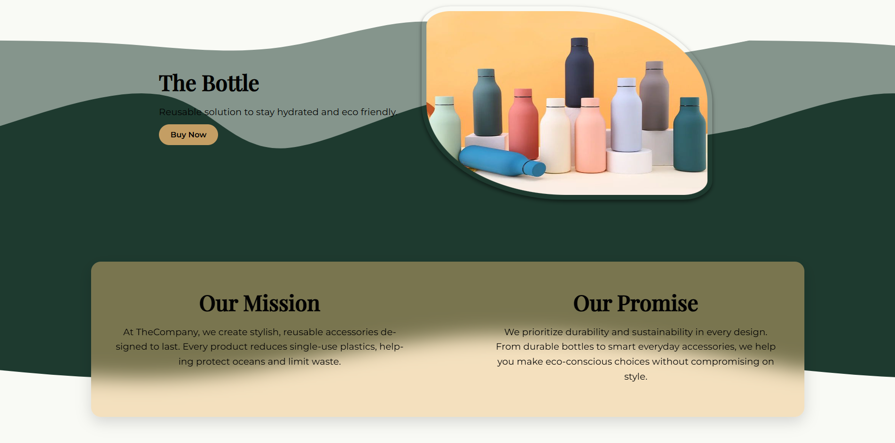

# The Bottle – Product Page  

A responsive, content-rich **product landing page** built to showcase my front-end design and development abilities.  
This project demonstrates modern UI/UX practices, clean layout design, and interactivity using **HTML, CSS, and JavaScript**.   

---

## 🛠️ Live demo coming soon!

---

## ✨ Features  

- **Hero Section** with call-to-action button and animated bottle display  
- **About Section** describing mission and brand promise  
- **Process Timeline** (6 steps) explaining how eco-friendly bottles are made  
- **Interactive Gallery** with hover overlays and scrollable grid layout  
- **Testimonials** to build trust and credibility  
- **Buy Section** with “Add to Cart” interaction  
- **Responsive Design** – optimized for desktop, tablet, and mobile  

---

## 🔧 Technologies  
- **HTML5** – semantic structure for accessibility & SEO  
- **CSS3** – Flexbox, Grid, custom animations, hover effects, responsive design  
- **JavaScript (Vanilla)** – simple interactivity (Add to Cart button)  
- **Google Fonts** – Montserrat & Playfair Display for typography  
- **SVG & Images** – custom graphics and background wave patterns    

---

## 📸 Preview  

 

---

## Future Improvements

I will continue working on design and add a few different modules, both static ones and interactive ones. I will also add a more interestic Add to Cart function to make the page feel more alive.

## Lessons Learned

Working on this project provided valuable experience in front-end styling and layout techniques. Key takeaways include:

- Improved understanding of CSS grid and flexbox for building responsive and well-structured layouts.  
- Gained practical experience with box styling, including border-radius, box-shadow, and custom framing techniques.  
- Learned how to effectively implement CSS animations using `transform` properties to move and scale elements smoothly.  
- Enhanced skills in using background images and ensuring they integrate seamlessly with responsive designs.  
- Developed strategies for creating text that scales dynamically with flexible containers, improving readability across devices.  

These insights have strengthened my ability to design visually appealing and responsive web interfaces.